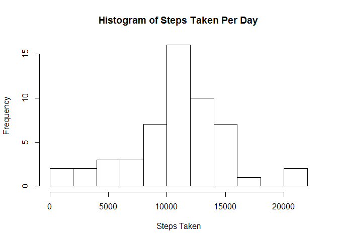
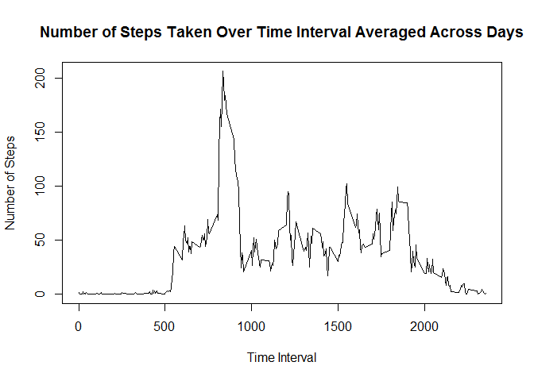
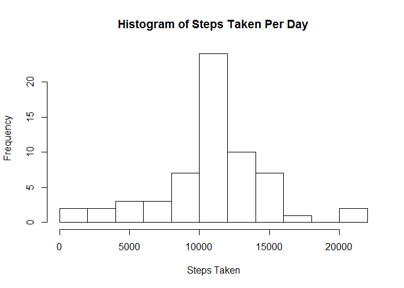

# Reproducible Research: Peer Assessment 1


## Loading and preprocessing the data
1. Load the data

```r
setwd("C:/Users/USER/Dropbox/Coursera/Reproducable Research/Project 1")
df <- read.csv("activity.csv") #Load data
```

2. Preprocess the data

```r
df.clean <- df[!is.na(df$steps),] #Clear out missing observations
```

## What is mean total number of steps taken per day?

1. Calculate the total number of steps per day

```r
df.agg <- aggregate(steps ~ date, data = df.clean, FUN = sum) #Total number of steps per day
```

2. Make a histogram of the total number of steps taken each day

```r
hist(df.agg$steps, main = "Histogram of Steps Taken Per Day", 
                   xlab = "Steps Taken",
                   breaks = 10)
```

 

3. Calculate and report the mean and median of the total number of steps taken per day

```r
mean(df.agg$steps)
```

```
## [1] 10766.19
```

```r
median(df.agg$steps)
```

```
## [1] 10765
```


## What is the average daily activity pattern?

1. Make a time series plot (i.e. type = "l") of the 5-minute interval (x-axis) and the average number of steps taken, averaged across all days (y-axis)


```r
df.agg.2 <- aggregate(steps ~ interval, data = df.clean, FUN = mean) #Mean of number of steps by time interval
plot(x = df.agg.2$interval, y=df.agg.2$steps, type= "l",
      main = "Number of Steps Taken Over Time Interval Averaged Across Days",
      ylab = "Number of Steps",
      xlab = "Time Interval")
```

 

2. Which 5-minute interval, on average across all the days in the dataset, contains the maximum number of steps?


```r
df.agg.2$interval[df.agg.2$steps==max(df.agg.2$steps)] 
```

```
## [1] 835
```


## Imputing missing values
1. Calculate and report the total number of missing values in the dataset

```r
sum(is.na(df$steps))
```

```
## [1] 2304
```

2. Devise a strategy for filling in all of the missing values in the dataset. The strategy does not need to be sophisticated. For example, you could use the mean/median for that day, or the mean for that 5-minute interval, etc.

3. Create a new dataset that is equal to the original dataset but with the missing data filled in.


```r
#Going to use mean for the 5 minute time interval
df.replacedNAs <- df
NAindex <- which(is.na(df$steps))
for(i in NAindex){
     interval.index <- df$interval[i]
     imputedvalue <- df.agg.2$steps[which(df.agg.2$interval==interval.index)]
     df.replacedNAs$steps[i] <- imputedvalue
}
```

4. Make a histogram of the total number of steps taken each day and Calculate and report the mean and median total number of steps taken per day. Do these values differ from the estimates from the first part of the assignment? What is the impact of imputing missing data on the estimates of the total daily number of steps?


```r
df.agg <- aggregate(steps ~ date, data = df.replacedNAs, FUN = sum) #Total number of steps per day
hist(df.agg$steps, main = "Histogram of Steps Taken Per Day", 
                   xlab = "Steps Taken",
                   breaks = 10)
```

 

```r
mean(df.agg$steps)
```

```
## [1] 10766.19
```

```r
median(df.agg$steps)
```

```
## [1] 10766.19
```

These did not have a difference on the mean or median because the imputation strategy involved replacing all the missing values with averaged values from other days. The histogram looks pretty much the same, as well, just taller at the mean.

## Are there differences in activity patterns between weekdays and weekends?


```r
library("ggplot2")
```

```
## Warning: package 'ggplot2' was built under R version 3.2.2
```

```r
df.replacedNAs$DayOfWeek <- factor(weekdays(as.Date(df.replacedNAs$date)))
# Levels Saturday and Sunday correspond to 3 and 4 as integers
df.replacedNAs$Weekday <- ifelse(as.integer(df.replacedNAs$DayOfWeek)==3|
                                 as.integer(df.replacedNAs$DayOfWeek)==4,
                                 "Weekend","Weekday") #If Sat or Sun, weekday=0, else =1
df.replacedNAs$Weekday <- factor(df.replacedNAs$Weekday)
df.plot <- aggregate(steps ~ interval + Weekday, data=df.replacedNAs, FUN=mean)
p1 <- ggplot(df.plot, aes(x=interval, y = steps)) +
  facet_grid(Weekday~.) +
  geom_line(size=.5) + 
  theme_bw() +
  xlab("Date") +
  ylab("Quantity") + 
  ggtitle("TF2 Trader Count by Week") + 
  theme(plot.title = element_text(lineheight=1, hjust = 0, family = "serif", face="bold", size = 19),
        legend.position="top",
        plot.title = element_text(size = rel(.5), color = "grey45",, family = "serif"),
        axis.title.x = element_text(hjust = 1, size = 14, color = "grey45",, family = "serif"),
        axis.title.y = element_text(size = 14, color = "grey45",, family = "serif"),
        axis.text =  element_text(size = 11, color = "grey45", angle=30, hjust=1),
        legend.text = element_text(size = 14, family = "serif", hjust = 0),
        axis.ticks = element_line(colour = 'grey45'), 
        panel.border = element_rect(color = "grey85"),
        panel.grid.major = element_line(colour = "grey45"))
p1
```

 

From the above, it does appear as though there are differences between weekday and weekend steps taken. The weekdays have a larger peak early in the day than do the weekend days and the weekend days have a peak late in the day (after 2000) that does not appear during the weekdays.
